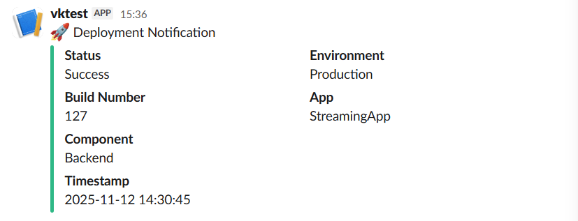

# StreamingApp

Stream premium video content, host live watch parties, and manage your catalogue with a modern microservice architecture. The platform now ships with a production-ready admin portal, real-time chat, S3-backed adaptive streaming, and a redesigned cinematic frontend experience.

## Architecture

| Service | Port | Description |
| --- | --- | --- |
| `authService` | 3001 | User authentication, registration, JWT issuance |
| `streamingService` | 3002 | Video catalogue, S3 playback endpoints, public APIs |
| `adminService` | 3003 | Dedicated admin microservice for asset management and uploads |
| `chatService` | 3004 | Websocket + REST chat for live watch parties |
| `frontend` | 3000 | React SPA with revamped UI and integrated chat |
| `mongo` | 27017 | Shared MongoDB instance |

All backend services share common database models and utilities through `backend/common`.

## Environment Configuration

Create an `.env` for each service (or export variables before running). All services accept the standard AWS credentials for S3 access.

### Auth Service (`backend/authService/.env`)
```ini
PORT=3001
MONGO_URI=mongodb://localhost:27017/streamingapp
JWT_SECRET=changeme
CLIENT_URLS=http://localhost:3000
AWS_ACCESS_KEY_ID=
AWS_SECRET_ACCESS_KEY=
AWS_REGION=us-east-1
AWS_S3_BUCKET=
```

### Streaming Service (`backend/streamingService/.env`)
```ini
PORT=3002
MONGO_URI=mongodb://localhost:27017/streamingapp
JWT_SECRET=changeme
CLIENT_URLS=http://localhost:3000
AWS_ACCESS_KEY_ID=
AWS_SECRET_ACCESS_KEY=
AWS_REGION=us-east-1
AWS_S3_BUCKET=
AWS_CDN_URL=
STREAMING_PUBLIC_URL=http://localhost:3002
```

### Admin Service (`backend/adminService/.env`)
```ini
PORT=3003
MONGO_URI=mongodb://localhost:27017/streamingapp
JWT_SECRET=changeme
CLIENT_URLS=http://localhost:3000
AWS_ACCESS_KEY_ID=
AWS_SECRET_ACCESS_KEY=
AWS_REGION=us-east-1
AWS_S3_BUCKET=
```

### Chat Service (`backend/chatService/.env`)
```ini
PORT=3004
MONGO_URI=mongodb://localhost:27017/streamingapp
JWT_SECRET=changeme
CLIENT_URLS=http://localhost:3000
```

### Frontend build variables (`frontend/.env` or Docker build args)
```ini
REACT_APP_AUTH_API_URL=http://localhost:3001/api
REACT_APP_STREAMING_API_URL=http://localhost:3002/api
REACT_APP_STREAMING_PUBLIC_URL=http://localhost:3002
REACT_APP_ADMIN_API_URL=http://localhost:3003/api
REACT_APP_CHAT_API_URL=http://localhost:3004/api
REACT_APP_CHAT_SOCKET_URL=http://localhost:3004
```

## Running with Docker Compose

1. Populate the environment variables above (or rely on the defaults baked into `docker-compose.yml`).
2. Build and start the stack:
   ```bash
   docker-compose up --build
   ```
3. Navigate to `http://localhost:3000` for the web app.

The compose file provisions MongoDB plus all four Node.js microservices. S3 credentials are optional for local testing—you can still browse seeded metadata, but streaming requires valid S3 objects.

## Local Development

Install dependencies for each service:

```bash
# auth service
cd backend/authService && npm install

# streaming service
cd ../streamingService && npm install

# admin service
cd ../adminService && npm install

# chat service
cd ../chatService && npm install

# frontend
cd ../../frontend && npm install
```

Run the services (in separate terminals) after starting MongoDB:

```bash
cd backend/authService && npm run dev
cd backend/streamingService && npm run dev
cd backend/adminService && npm run dev
cd backend/chatService && npm run dev
cd frontend && npm start
```

## Feature Highlights

- **S3-backed adaptive streaming** with secure signed uploads for admins.
- **Dedicated admin microservice** for video ingestion, metadata management, and featured curation.
- **Real-time chat** overlay in the player (Socket.IO + persistent message history).
- **Modern React experience** featuring cinematic hero sections, dynamic carousels, and responsive design.
- **Role-aware access control** across frontend routes and backend microservices.

## Testing

Automated tests are not yet included. Recommended smoke checks:

1. Register and log in through the web UI.
2. Upload a small video + thumbnail via the admin dashboard (requires valid S3 credentials).
3. Confirm playback from the browse page and verify that chat messages broadcast between multiple browser tabs.

## License

MIT © StreamFlix Team

Steps to execute the assignment 


Now lets create the image and push the same to the ECR 
we are creating the script to push the images to teh ECR
then we will set the configmap to make it running by kubernets than by HELM then will configure the same in Jenkins file


This project demonstrates end-to-end containerization, CI/CD, cloud orchestration, deployment scaling, and monitoring of a MERN-based Streaming Application using Docker, Amazon ECR, Jenkins, EKS, Helm, and CloudWatch.

Main Repository: UnpredictablePrashant/StreamingApp

Table of Contents

Project Overview

Architecture Diagram

Prerequisites
Step 1 — Clone Repository

Step 2 — Containerize the Application

Step 3 — AWS Environment Setup

Step 4 — Continuous Integration (jenkins)

Step 5 — Kubernetes Deployment (EKS)

Step 6 — Monitoring & Logging

Step 7 — Documentation

Step 8 — Final Validation

Folder Structure

License

📦 Project Overview

This assignment covers the entire lifecycle of a cloud-native MERN application:

Containerization of frontend and backend

Automated builds & deployments using Jenkins

Image registry management with AWS ECR

Kubernetes orchestration using Amazon EKS and Helm charts

Monitoring & alerting using AWS CloudWatch

ChatOps integrations using SNS + Slack/Teams/Telegram

Architecture Diagram

GitHub Repo → Jenkins (CI) → Amazon ECR → EKS Cluster (Helm Deployments)
                                                                                                
                                         Jenkins -> SNS → Lambda -> Slack (with the help of Lambda)

Prerequisites

Ensure the following tools/services are available:

Local Tools

Docker

AWS CLI

Kubectl

eksctl

Helm

Git

Cloud Services

AWS ECR

AWS IAM

Amazon EC2 (for Jenkins)

Amazon EKS

CloudWatch

Step 1 — Clone Repository
git clone https://github.com/UnpredictablePrashant/StreamingApp.git cd StreamingApp

Step 2 — Containerize the Application
2.1 Create Dockerfiles

Frontend Dockerfile
FROM node:18-alpine
WORKDIR /app
COPY package*.json ./
RUN npm install
COPY . .
RUN npm run build
EXPOSE 3000
CMD ["npm", "start"]

Backend Dockerfile
FROM node:18-alpine
WORKDIR /app
COPY package*.json ./
RUN npm install
COPY . .
EXPOSE 5000
CMD ["npm", "start"]

2.2 Build Docker images of all the 5 Microservice and push to ECR with the help of scripts

./scripts/build-and-push.sh  <account-id>.dkr.ecr.<region>.amazonaws.com/vijaystreamingapp/ v1.0 

2.3 Create ECR Repositories

aws ecr create-repository --repository-name  <account-id>.dkr.ecr.<region>.amazonaws.com/vijaystreamingapp/frontend
aws ecr create-repository --repository-name  <account-id>.dkr.ecr.<region>.amazonaws.com/vijaystreamingapp/chatservice
aws ecr create-repository --repository-name  <account-id>.dkr.ecr.<region>.amazonaws.com/vijaystreamingapp/stremingbackend
aws ecr create-repository --repository-name  <account-id>.dkr.ecr.<region>.amazonaws.com/vijaystreamingapp/authservice
aws ecr create-repository --repository-name  <account-id>.dkr.ecr.<region>.amazonaws.com/vijaystreamingapp/adminservice

2.4 Authenticate Docker to ECR

aws ecr get-login-password \

| docker login --username AWS --password-stdin <AWS_ACCOUNT_ID>.dkr.ecr..amazonaws.com

2.5 Push images to ECR
image push will be taken care by ./scripts/build-and-push.sh

Step 3 — AWS Environment Setup

 We are using the herovired jenkins and configure the AWS credectial so our cluster can be accesss through the Jenkins nodes.

Step 4 — Continuous Integration (CI) using Jenkins

webhook is configured so any commit in the repo will call the CI pipeline followed by the CD pipeline automatically if all the stages succesfully executed.

Step 5 — Kubernetes Deployment (EKS)

With the help of clickops we create EKS cluster with verion 1.34.

5.2 Deploy using Helm

Helm directory contiains all the helm charts used for this application and it will be called by the CD pipelines and credentials are configured to connect to the correct cluster so it will deploy it correctly. these helm charts calling are the part of the CD pipeline which will be called from the CI if all teh stages passed.

Step 7 — Documentation

Include:

Architecture diagrams

CI/CD pipeline flowchart

Helm chart structure

EKS cluster configuration

Jenkins job configurations

Upload all documentation to /docs in the repository.

✔️ Step 8 — Final Validation

Verify the following:

✔ Frontend is publicly accessible ✔ Backend API endpoints are responding ✔ Pods auto-scale under load ✔ Jenkins pipeline triggers on commits ✔ ECR images are updated ✔ Logs and metrics visible in CloudWatch

Bonus Step 9 — ChatOps Integration 9.1 Create SNS Topics


9.2 Integrate SNS with Slack 


Use:


Jenkins called SNS API + SNS → Lambda → Slack

Send notifications for:

Deployment success



Build failure

Scaling events
